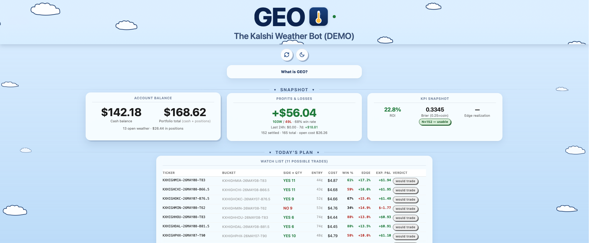

# GEO — The Kalshi Weather Bot

> **Live demo:** **[apeabody007.github.io/GEO-The-Kalshi-Weather-Bot-DEMO](https://apeabody007.github.io/GEO-The-Kalshi-Weather-Bot-DEMO/)**

A live algorithmic trading system for [Kalshi](https://kalshi.com) weather
prediction markets — a CFTC-regulated event-prediction exchange. GEO scans
1°-wide bracket and tail-cutoff contracts on daily-high temperatures across
20 U.S. cities, prices each market against a multi-model probabilistic
forecast, and trades mispricings with real capital.



---

## What you're looking at

This repository hosts a **public, read-only preview** of GEO's live
operations dashboard, rendered with **fully synthetic data**. No real
positions, no real bankroll, no live API calls. Every section that would
reveal the bot's competitive setup (per-model diagnostics, calibration
curve, structural-arb detector, resting maker orders, project roadmap) is
locked and intentionally absent from the public preview. Source code is
private.

The live system runs on the operator's machine against real Kalshi
markets, served as a Tailscale-private PWA.

## What's here

```
index.html              the rendered dashboard (single self-contained file)
manifest.json           PWA manifest
icon-*.png              app icons
```

That's the entirety of the public surface. The dashboard's renderer, data
feed, server, strategy code, calibration models, and trade ledger are all
private and not part of this repository.

## Engineering at a glance

- **Stack:** Python 3.11, signed REST client against the exchange's API,
  SQLite trade ledger, server-rendered vanilla-JS dashboard, Tailscale-served
  PWA.
- **Forecasting:** multi-model probabilistic ensemble with per-station
  bias correction calibrated against historical climate observations.
- **Trading layer:** fractional-Kelly position sizing under multiple risk
  caps; maker-only pricing to sidestep taker fees.
- **Reliability:** single-instance file lock prevents order collisions,
  circuit breaker around upstream APIs throttles rate-limits, year-round
  local-time handling avoids DST settlement misalignment, ~110 pytest
  cases gate every release.
- **Observability:** server-rendered HTML on every page load (no caching
  between operator and the truth), per-cell drift detection, full P&L
  attribution by multiple decision dimensions, calibration reliability
  curve, automated reconciliation against the exchange's official
  settlement source.

## See also

**[Quant Toolkit](https://github.com/apeabody007/Quant-toolkit)** — a
venue-agnostic Cowork plugin distilled from operating GEO. Nine skills
covering the full loop from idea to live trading: Kelly sizing,
calibration audit, EMOS bias correction, backtest harness, maker pricing,
P&L attribution, pre-flight checklist, market scanner, drawdown monitor.
Bring your own model and exchange.

## Built by

[Aaron Peabody](https://www.linkedin.com/in/aaronpeabody7/) — BA Economics
(Wisconsin), BS Psychology (UCF). For collaboration or hiring inquiries,
reach me on LinkedIn.

